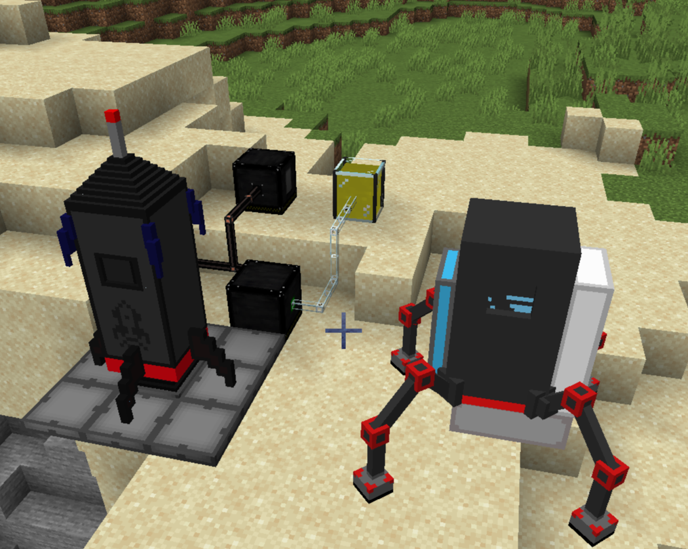

# Heliopause Core
Notice: This repository is made public strictly for code-review purposes. This is a closed-source project. Copying, modifying, redistributing, or compiling this code for personal or commercial use is strictly prohibited. © 2026 Venus Macubass. All Rights Reserved.

# Project Status
Work in Progress. Currently serving as a technical sandbox for exploring advanced Java backend architecture, network synchronization, and the NeoForge API. This mod is planned to become open source when the base mod is complete.

# Overview
The project was born from a desire to fix the lack of a proper "space mod" in modern versions issue.

Originally conceived as a modernization effort for a certain old once-mainstream tech and space mod. Yet, later I pivoted the project into a completely original architecture after noticing the prohibitive All Rights Reserved licensing constraints of older mods. Today, Heliopause Core stands as its own original project and the first of its series. While its primary design goal is to deliver a cohesive space-survival experience, it also serves as a technical sandbox to solve complex backend engineering challenges.

# Technical Highlights
## Custom Cross-Dimension Transports: 
Engineered a rideable, client-server synchronized vehicle system that manually overrides the vanilla engine's gravity and movement assumptions.

## Network Synchronization:
Designed custom data packets to handle real-time physics inputs (e.g., thruster control) and eliminate client-server desync across tick loops.

## Stateful Dimension Transfers:
Implemented NBT data serialization and asynchronous lambda callbacks to safely transfer complex entities (maintaining cargo, energy, fluid data, and passengers) across dimensions without memory leaks or index crashes.

## Object-Oriented Industrial Networks:
Designed energy and fluid transfer systems using Capabilities, allowing machines like Gas Compressors and Refineries to process data autonomously.

## Multi-Block Structure Logic:
Utilized 3D grid math and blockstate updates to dynamically detect, validate, and manage multi-block structures.

## Atmospheric & Terrain Systems:
Arranged chunk generation algorithms and custom tick events to simulate harsh environmental factors in space.

# Tech Stack
#### Language: Java 21

#### Framework: NeoForge API (1.21.1)

#### Build System: Gradle